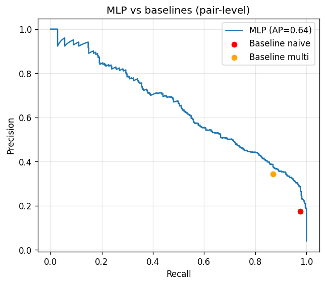
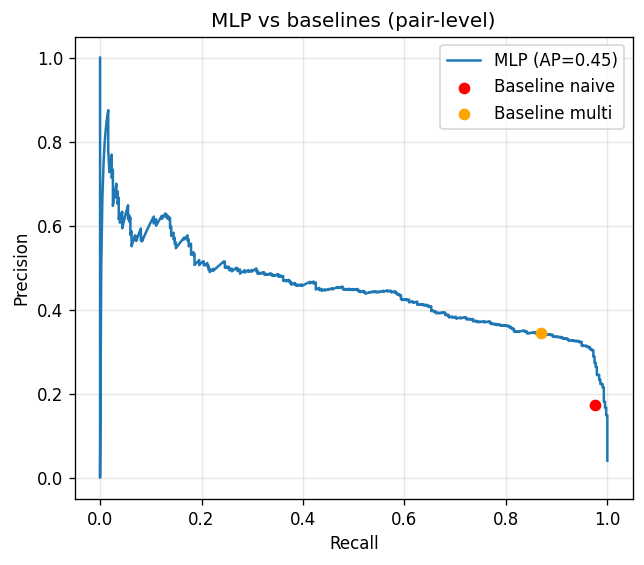
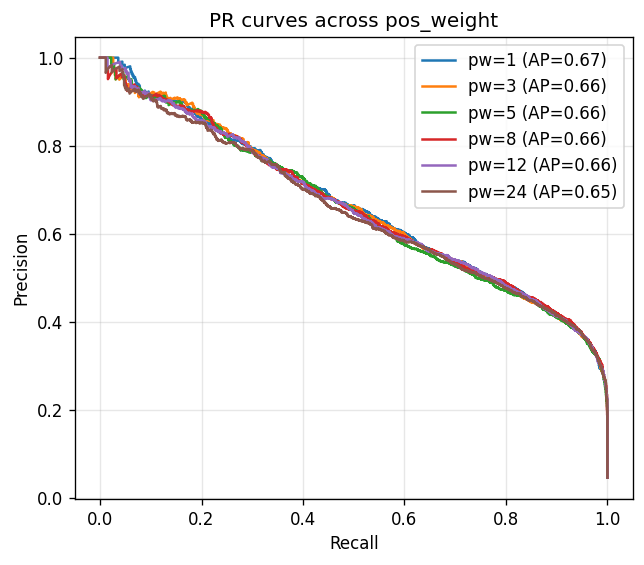

# NS-Guard: Learned Relational Safety Guardrails for Object Detection

**High-Level Computer Vision (SS26) — Universität des Saarlandes**
Anushka Choudhary · Shreya Kolhapure · Umair Ayaz Aslam

A lightweight learned relational head that flags **inter-object safety hazards**
(e.g. a cup too close to a laptop) from the output of a frozen object detector —
and beats both a naive and a strong hand-crafted symbolic baseline by learning
to exploit the detector's **confidence scores**.

## Key results (trained on COCO train2017, tested on untouched val2017)

Pair-level, evaluated once on the held-out val2017 detections. No val2017 image
was seen during training; the head was trained on 267,417 detected object pairs
from train2017.

| | Naive baseline | Symbolic baseline | MLP (no conf.) | **MLP (full)** |
|---|---|---|---|---|
| AP | — | — | 0.451 | **0.643** |
| F1 @0.5 | 0.295 | 0.493 | 0.423 | **0.539** |
| FPR @0.5 | 0.195 | 0.070 | 0.020 | **0.007** |

Removing the confidence features (ablation) drops AP from **0.643 to 0.451** and
erases the advantage over the strong symbolic baseline — the learned head's gain
comes specifically from discounting unreliable, low-confidence detections.

On the pairs where the MLP and the strong baseline disagree (837 of 10,745), the
MLP is correct **645** times versus **192** for the baseline.

Full run logs are in [`results/`](results/). The PR curves below show the full model, the confidence ablation, and the pos_weight sweep.







## Quickstart

The headline result comes from training on COCO train2017 and evaluating on
val2017. A GPU is recommended for the detector pass over train2017
(~3-4 h on a T4); the steps below mirror the run that produced the numbers above.

```bash
pip install -r requirements.txt

# data: COCO train2017 (training) + val2017 (test) + annotations
wget http://images.cocodataset.org/annotations/annotations_trainval2017.zip && unzip annotations_trainval2017.zip
wget http://images.cocodataset.org/zips/train2017.zip && unzip train2017.zip
wget http://images.cocodataset.org/zips/val2017.zip && unzip val2017.zip

# 1. run the frozen detector over BOTH splits (train2017 is the long step)
python detect.py --image-dir ./train2017 --out detections_train.json --conf 0.15 --iou 0.7
python detect.py --image-dir ./val2017   --out detections_val.json   --conf 0.15 --iou 0.7

# 2. (optional) sweep pos_weight on train2017 to pick the operating point
python sweep.py --annotations ./annotations/instances_train2017.json --detections detections_train.json

# 3. train the relational head on train2017 (plus the no-confidence ablation)
python train.py --annotations ./annotations/instances_train2017.json --detections detections_train.json --pos-weight 1 --out best_model.pt
python train.py --annotations ./annotations/instances_train2017.json --detections detections_train.json --pos-weight 1 --no-confidence --out best_model_noconf.pt

# 4. TEST on untouched val2017 (run once per model)
python evaluate.py --annotations ./annotations/instances_val2017.json --detections detections_val.json --model best_model.pt --split all

# 5. live demo (webcam; or pass an image/folder/video path)
python infer.py --source 0 --model best_model.pt --show --flag-thresh 0.6 --top-n 4
```

For a quick local smoke test without the full train2017 download, run the same
pipeline on val2017 alone and add `--limit 200` to the detector pass — but the
headline numbers above come from the train2017 → val2017 setup.

---

## Full documentation

End-to-end vision pipeline that flags **relational safety hazards** (e.g. a cup
too close to a laptop) from raw images:

```
image ─▶ frozen YOLO ─▶ boxes+classes+confidences ─▶ pairwise features
                                                          │
                                          ┌───────────────┴───────────────┐
                                          ▼                               ▼
                            BASELINE (single global              MLP head (geometry +
                            distance threshold)                  confidence + class)
```

## The idea (why the MLP isn't redundant)

- **Features** (MLP input) come **only from the detector**: geometry + the
  detector's **confidence** scores + a class one-hot. (15-dim.)
- **Labels** (truth) come from **COCO ground truth**: a detected pair is a true
  hazard only if both detections IoU-match real objects **and** the real objects
  satisfy the hazard rule. Spurious detections → SAFE.
- **Baseline** = a **single global distance threshold** applied to the detector's
  boxes — the naive "one hand-set number" heuristic. It cannot do
  per-relationship thresholds or multi-factor logic, so the MLP has room to win.

The MLP can beat the baseline by (1) learning **per-class** safety distances via
the one-hot, (2) **discounting low-confidence** spurious detections, and (3)
capturing **multi-factor** hazards the single threshold can't express.

## Hazard definition (`HAZARD_MODE` in data_pipeline.py)

- `"distance"` — hazard = close (per-class threshold). Pure single-feature rule;
  the single-threshold baseline is already near-optimal, so expect a TIE.
- `"multi"` — hazard = close **AND** (overlapping **OR** similar-size). Cannot be
  expressed by one distance threshold, so the baseline is provably suboptimal and
  the MLP can win. **This is the default.**

To A/B the two, change `HAZARD_MODE`, retrain, re-evaluate.

## Setup

```bash
pip install torch torchvision numpy scikit-learn ultralytics opencv-python
```

`ultralytics` auto-downloads YOLO weights on first use. Default `yolov8m.pt`.

## Inference / deployment (no ground truth)

`infer.py` is the live guardrail — detector → MLP → draw flagged pairs. No GT,
no labels, no baseline.

```bash
python infer.py --source img.jpg --model best_model.pt                 # single image
python infer.py --source ./val2017 --model best_model.pt --out-dir ./annotated
python infer.py --source clip.mp4 --model best_model.pt --out-dir ./annotated
python infer.py --source 0 --model best_model.pt --show                # webcam (q quits)
python infer.py --source 0 --model best_model.pt --show --flag-thresh 0.3   # over-warn
```

Draws each flagged pair's two boxes in red + connecting line + rule/probability,
dims other detections, shows a HAZARD banner. For video/webcam it prints the mean
per-frame guard overhead (pairing + MLP time, excluding the detector).

## Feature vector (15-dim)

> Built in ONE place — `data_pipeline.build_feature` — called by both training
> and inference, so the layout can never drift. Features are then **standardized**
> (mean/std fit on the TRAIN split only, saved inside the checkpoint, applied
> identically at eval and inference).

| index | feature | source |
|-------|---------|--------|
| 0 | normalized centroid distance | detector |
| 1–2 | dx, dy (normalized, signed) | detector |
| 3 | IoU | detector |
| 4 | area ratio | detector |
| 5–6 | overlap_x, overlap_y | detector |
| 7–8 | normalized area of A, B | detector |
| 9 | fraction of A covered by B | detector |
| 10–11 | **confidence of A, B** | detector |
| 12–14 | one-hot of which rule pair | detector |

Ground truth is used **only** to compute the label, never as a feature.

## Checkpoint format

`best_model.pt` is a dict: `{model, mean, std, input_dim, hazard_mode}`.
`evaluate.py` and `infer.py` read the scaler from it so preprocessing matches
training exactly.

## Metrics

- **Recall** — fraction of true hazards flagged.
- **FPR** — fraction of safe cases wrongly flagged.
- Reported pair-level and image-level (OR aggregation).
- `evaluate.py` dumps the disagreement set (MLP vs baseline) and who's right —
  the edge-case analysis. Read **"On disagreements: MLP correct X, baseline
  correct Y"** as the headline verdict.

## Experiments

Two baselines are reported, both applied to the **detected** boxes:
- **naive** — a single global distance threshold (a non-expert's one-number rule).
- **multi** — the FULL multi-factor hazard rule (the symbolic NS-Guard). This is
  the STRONG baseline: if the MLP beats it, the win comes from using detector
  **confidence**, which no rule-on-detections can.

**Confidence ablation** — train the head with the confidence features zeroed:

```bash
python train.py --annotations ./annotations/instances_train2017.json \
    --detections detections_train.json --pos-weight 1 --no-confidence --out best_model_noconf.pt
```

Without confidence, AP falls from 0.643 to 0.451, confirming the head's advantage
is confidence-awareness. `evaluate.py` honors the ablation flag stored in the
checkpoint.

**Per-rule metrics** — `evaluate.py` reports precision/recall/F1/FPR (and AP for
the MLP) broken down by rule pair (cup-laptop, person-car, knife-person), since
different relationships behave very differently.

## Tuning

- The `pos_weight` sweep (`sweep.py`, values 1–24) picks the operating point;
  `pos_weight=1` gave the best AP here.
- If the MLP–baseline gap is small in `"distance"` mode, switch
  `HAZARD_MODE = "multi"`.
- Lower `--conf` (e.g. 0.10) to admit more shaky detections (more for the
  confidence feature to exploit).
- Per-class thresholds live in `PAIR_RULES`; the baseline's single threshold is
  `GLOBAL_BASELINE_THRESHOLD` (default = mean of the per-class ones).

## Known limits

- **Missed detections are a shared ceiling**: if the detector never sees an
  object, neither baseline nor MLP can flag it — both take the false negative.
- **Out-of-vocabulary objects** (not in COCO's 80 classes) can't be guarded.
- The relational head's recall is bounded by the detector's recall.
